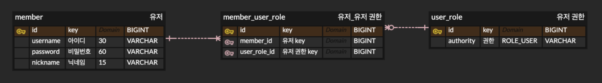
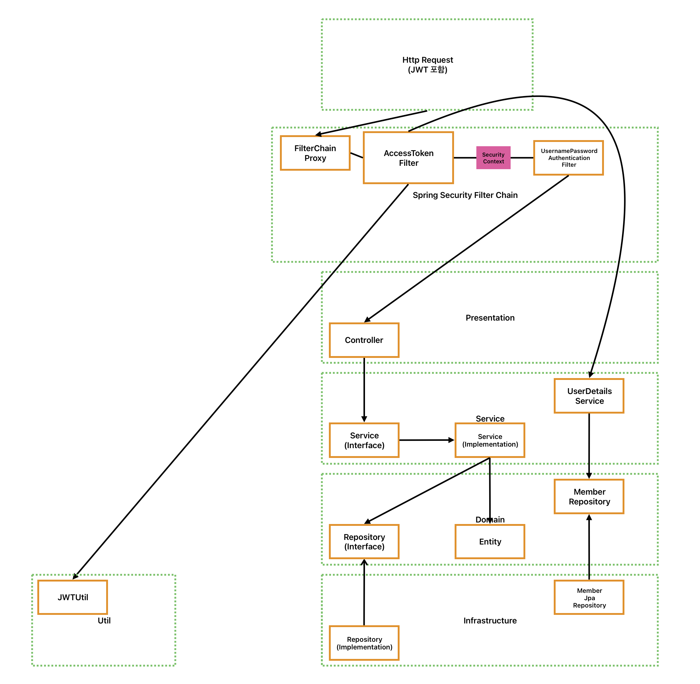

# JWT-SECRET

## 사용자 회원가입 및 로그인 구현

Spring Security를 사용하여 JWT 필터를 통해 로그인을 구현했습니다.

---

## ERD



---

## 시큐리티 필터 (with JWT) 및 계층 다이어그램 



### Security 흐름 정리

1. Http 요청 (with JWT) 요청이 들어오면 Spring Security 의 Filter Chain Proxy 로 전달됩니다.
2. AccessTokenFilter 에서 요청 헤더의 JWT를 추출합니다.
   1. JWT 의 유효성을 검사하고, 사용자 정보를 가져옵니다.
   2. 사용자 정보를 기반으로 UserDetailsService 를 호출하여 사용자 정보를 가져옵니다.
   3. 인증 정보를 가지고 SecurityContextHolder 에 설정 합니다.
3. SecurityContextHolder
   - 인증 정보를 저장합니다.
   - 저장 된 정보를 가지고 Controller 등에 활용합니다.

### 전체 레이어 흐름 (DIP 포함)

1. Controller는 HTTP 요청을 받아 Service Interface를 호출합니다.
2. Service Interface는 비즈니스 로직을 수행하기 위해 Service Implementation에 요청을 전달합니다.
3. Service Implementation은 Repository Interface를 통해 DB 작업을 요청합니다.
4. Repository Interface는 Infrastructure 계층의 Repository Implementation을 통해 실제 DB와 연결하여 데이터를 저장, 수정, 읽기 등의 작업을 수행합니다.

---

## API

[Swagger UI 로 접속하여 API 목록을 확인 할 수 있습니다.](http://54.180.221.241:8080/swagger-ui/index.html)

1. 회원가입 (POST /signup)
    - Request Message

       ```json
       {
           "username": "JIN HO",
           "password": "12341234",
           "nickname": "Mentos"
       }
       ```

    - Response Message

       ```json
       {
           "username": "JIN HO",
           "nickname": "Mentos",
           "authorities": [
                   {
                           "authorityName": "ROLE_USER"
                   }
           ]		
       }
       ```


2. 로그인 (POST /sign)
    - Request Message

       ```json
       {
           "username": "JIN HO",
           "password": "12341234"
       }
       ```

    - Response Message

       ```json
      // Response Message 는 RFC6750 표준을 따릅니다. (Body 로 응답), grant_type 은 제외했습니다.
      // https://www.rfc-editor.org/rfc/rfc6750#section-2.1 (4. Example Access Token Response)
       {
           "token": "eyJhbGciOiJIUzI1NiIsInR5cCI6IkpXVCJ9",
           "refreshToken": "eyJhbGciOiJIUzI1NiIsInR5cCI6IkpXVCJ9"
       }
       ```

3. 리프레시 토큰을 통한 액세스 토큰 재발급 (POST /refresh-token)
    - Request Message

       ```json
      // Refresh Token 재발급 시 요청은 RFC6749 표준을 따릅니다. (Body 로 요청), grant_type 은 제외했습니다.
      // https://www.rfc-editor.org/rfc/rfc6749#section-10.4 (6. Refreshing an Access Token)
       {
           "refreshToken": "eyJhbGciOiJIUzI1NiIsInR5cCI6IkpXVCJ9"
       }
       ```

    - Response Message

       ```json
      // Response Message 는 RFC6750 표준을 따릅니다. (Body 로 응답), token_type 은 제외했습니다.
      // https://www.rfc-editor.org/rfc/rfc6750#section-2.1 (4. Example Access Token Response)
       {
           "token": "eyJhbGciOiJIUzI1NiIsInR5cCI6IkpXVCJ9",
           "refreshToken": "eyJhbGciOiJIUzI1NiIsInR5cCI6IkpXVCJ9"
       }
       ```

